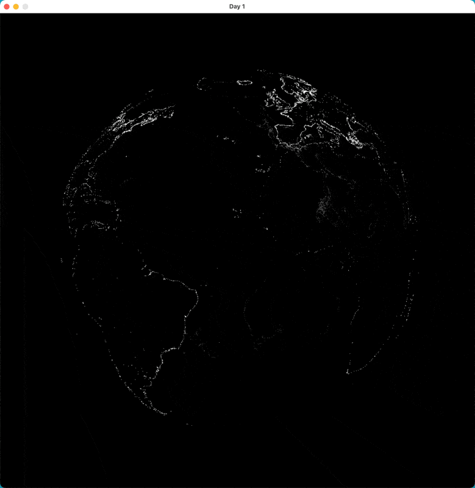

# 30daymapschallenge: Day 1 - Points

Day 1 of [30daymapschallenge](https://30daymapchallenge.com), the theme is points. I [already had some code](https://github.com/mdales/claudius-examples/blob/main/day1/bin/main.ml) from day 1 of [Genuary](https://genuary.art), which pretty much started with the same prompt, that made a sphere of points, so I combined that with loading data from a [GeoJSON](https://en.wikipedia.org/wiki/GeoJSON) file, and plotting point data in the GeoJSON on the rotating sphere.

For example, here it is showing [a dataset of lighthouse locations](https://www.kaggle.com/datasets/bcruise/lighthouse-locations):

