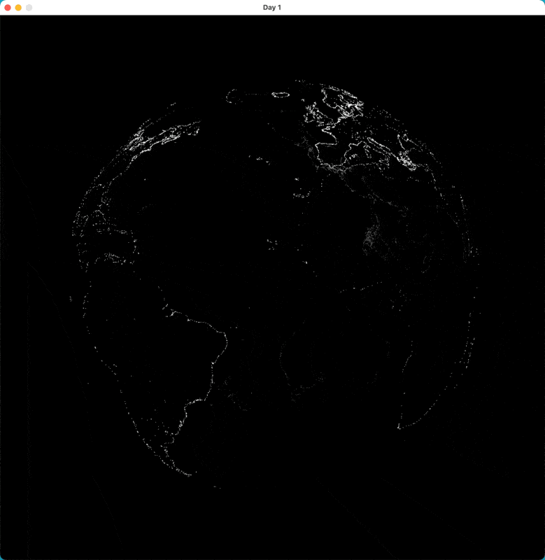

# 30daymapschallenge: Day 1, Day2, & Day 3

## Day 1 - Points

Day 1 of [30daymapschallenge](https://30daymapchallenge.com), the theme is points. I [already had some code](https://github.com/mdales/claudius-examples/blob/main/day1/bin/main.ml) from day 1 of [Genuary](https://genuary.art), which pretty much started with the same prompt, that made a sphere of points, so I combined that with loading data from a [GeoJSON](https://en.wikipedia.org/wiki/GeoJSON) file, and plotting point data in the GeoJSON on the rotating sphere.

For example, here it is showing [a dataset of lighthouse locations](https://www.kaggle.com/datasets/bcruise/lighthouse-locations):

## Day 2 - Lines

For Day 2 the theme is lines, so I abstracted out the GeoJSON code to make it easier to build up, and added line support, and now am displaying [some data on global shipping lanes](https://zenodo.org/records/6361813). That said, it is turning into a tool that I can just throw a GeoJSON file at and have it render on a spinning globe.

## Day 3 - Polygons

For Day 3 the theme is polygons, so somewhat predicatably I opted to extend my GeoJSON globe projection code again to handle polygon data types, in the example here I'm display [this map of ocean currents](https://gist.github.com/jalbertbowden/5d04b722ced715e32cee3e8c8c4df95b). I had hoped to do something more interesting visually, but I spent a bunch of my time budget failing to find the sort of datasets I wanted, due to a lot of gatekeeping on supposedly open datasets.

